# Learning-Snowflake-Snowpark
This repository will walk you through running Snowflake Snowpark Python demo in a Chrome browser.

## Requirements
* Install [Chrome](https://www.google.com/chrome/)
* Sign up for a [Github](https://github.com/) account
  * Once you have a GitHub account you need to fork [this](https://github.com/sfc-gh-eplata/sfc-snowpark-environment) repository to your own space
   * 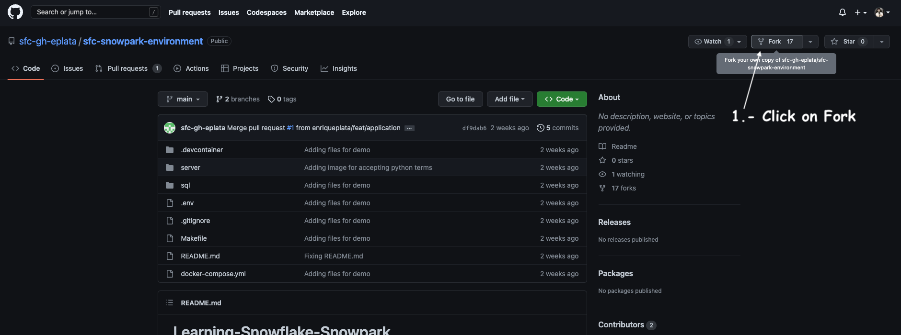
   * 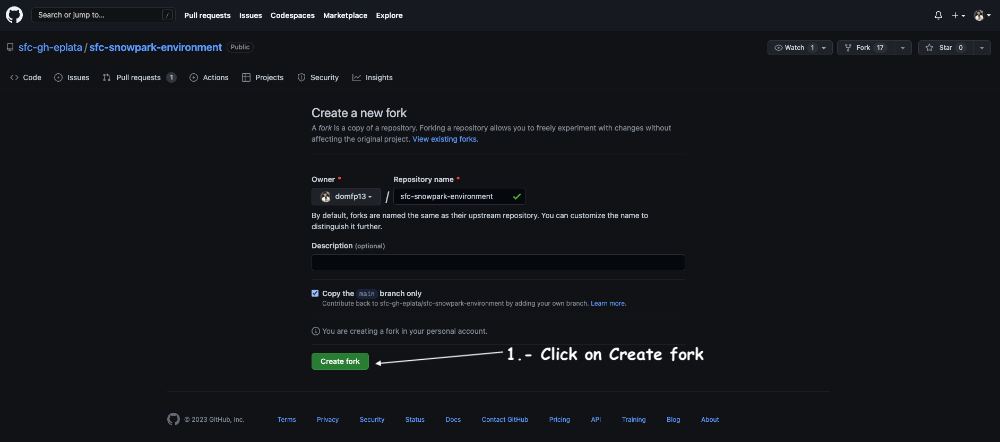
* Snowflake Account
   * [Signup](https://signup.snowflake.com/) for a FREE Snowflake account, make sure that you select the following setup is placed:
   * 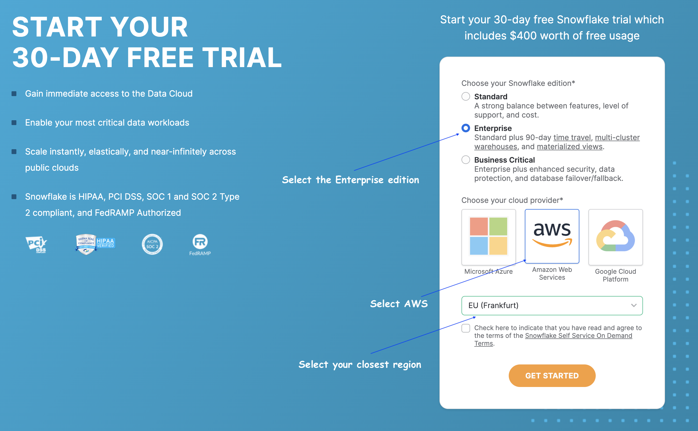
   * In your mailbox you should have received an email, this will activate the account
   * 
   * Activate your account, and make sure you remember the user & password, you will need them in the next step to log in, it's VERY important you remember them otherwise this will NOT work.

## Setup
  * Once you are logged into your Snowflake account, click in the top right corner and create a new worksheet
    * 
  * Inside of this repository there is a sql scrip, copy the code and paste it in the new worksheet you just created, here is the script link [setup.sql](sql-setup/setup.sql)
  * Once you pasted, scroll down to the bottom and replace 'XXX' for the password you prefer.
    * 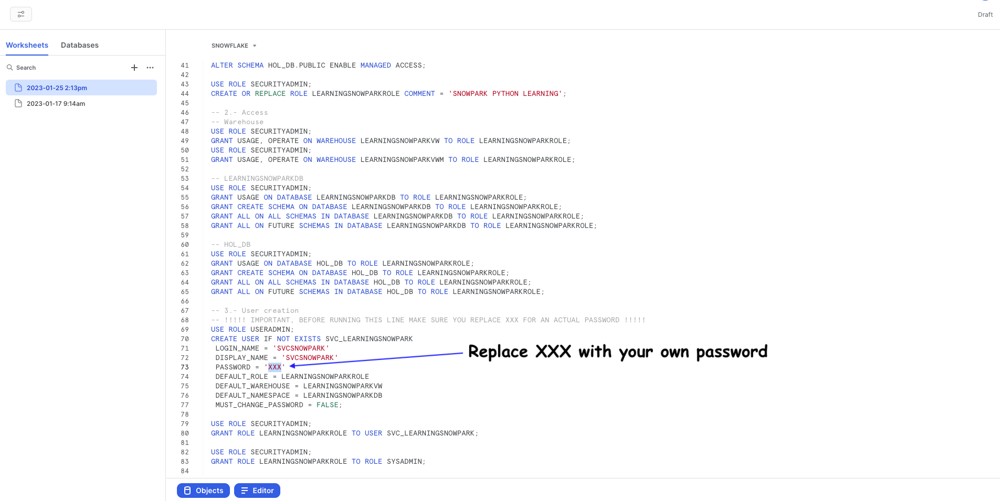
  * After changing the value go to the top and select everything and run the script by clicking the play button (top right corner), make sure you select all the scripts first.
    * 
  * Go back to the home menu
    * 
  * Once you are in the home menu, copy the locator from your account by:
    * 
  * Go back to your browser (GitHub) and click on settings, make sure you are in the repository you forked (starts with your GitHub username)
    * 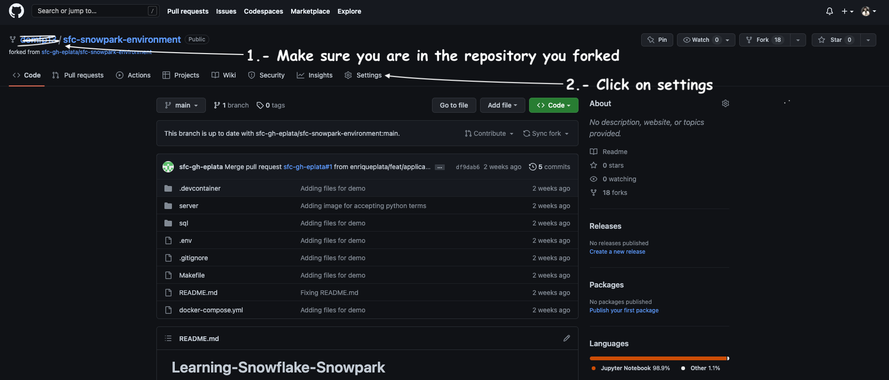
    * 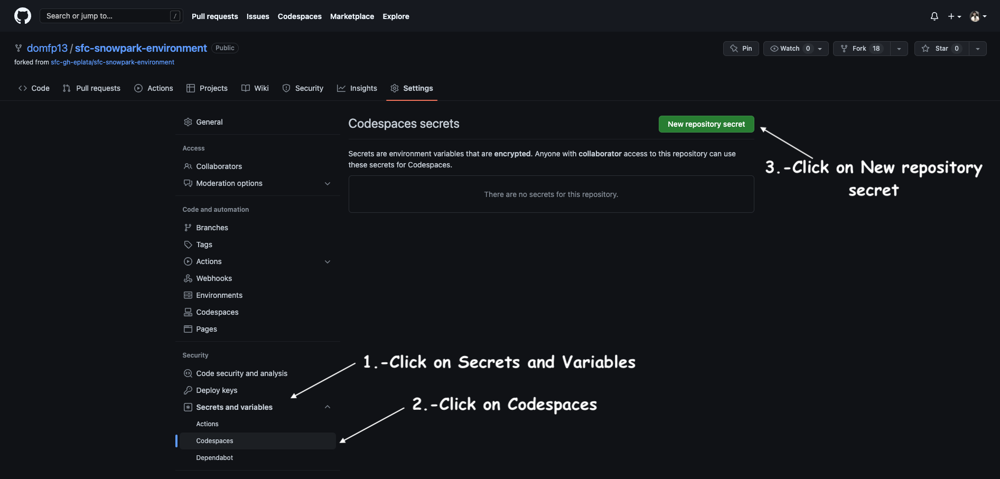
  * We need to create two parameters `SNOWFLAKE_ACCOUNT` & `SNOWFLAKE_PASSWORD` lets create one at the time (DO NOT put the values in the same variable)
    * 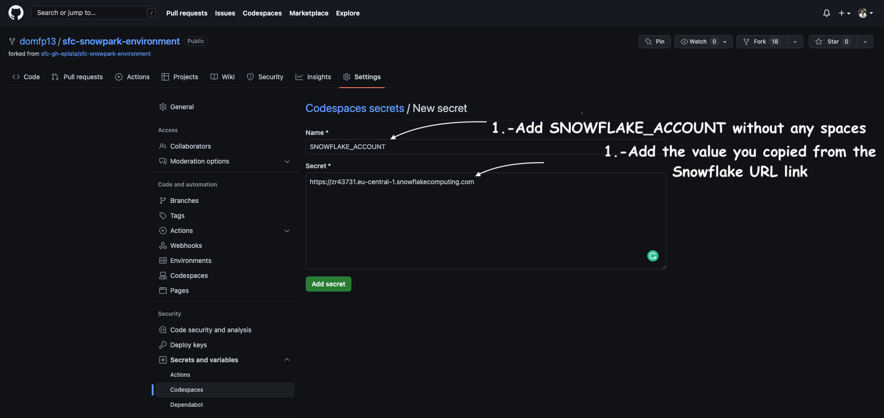
    * 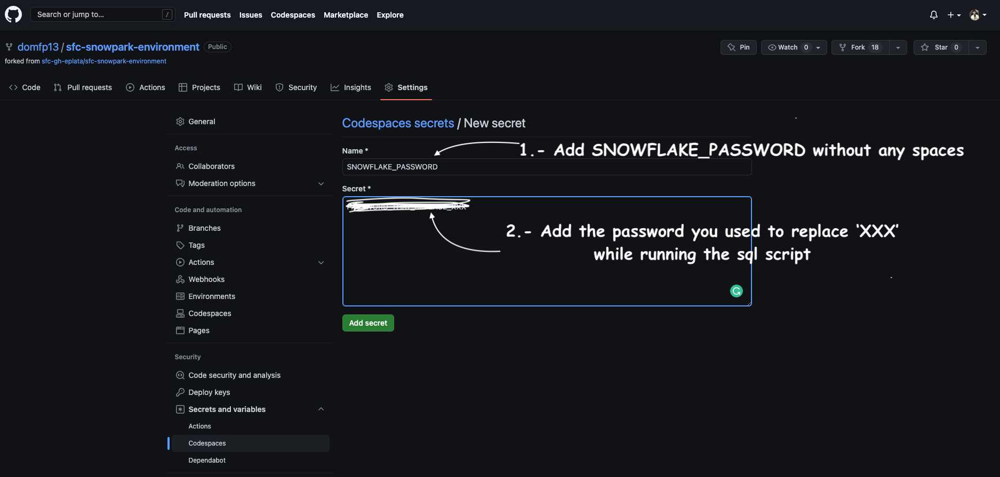
  * At the end you should have some like this:
    * 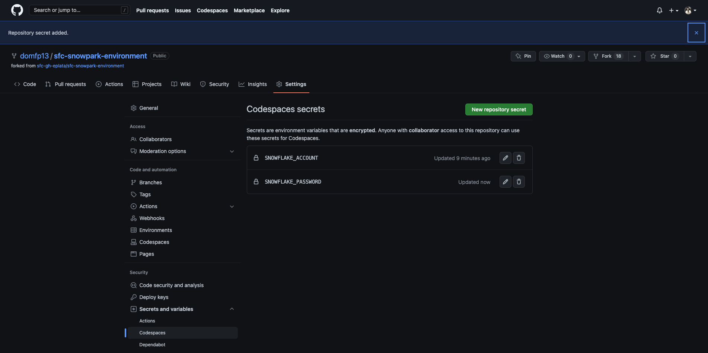
  * The last thing we need to do is to lunch a Codespace instance
    * 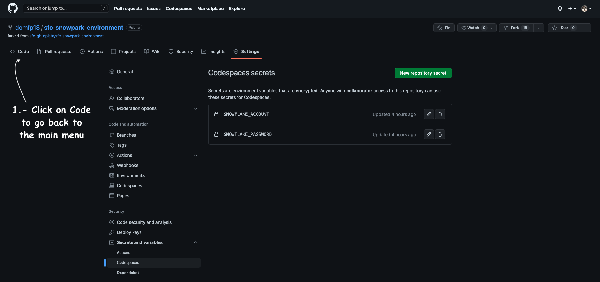
    * 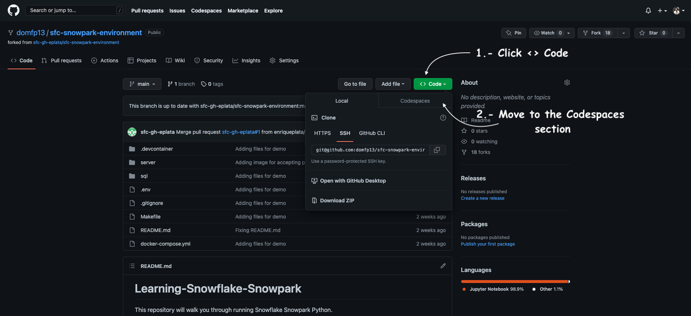
    * 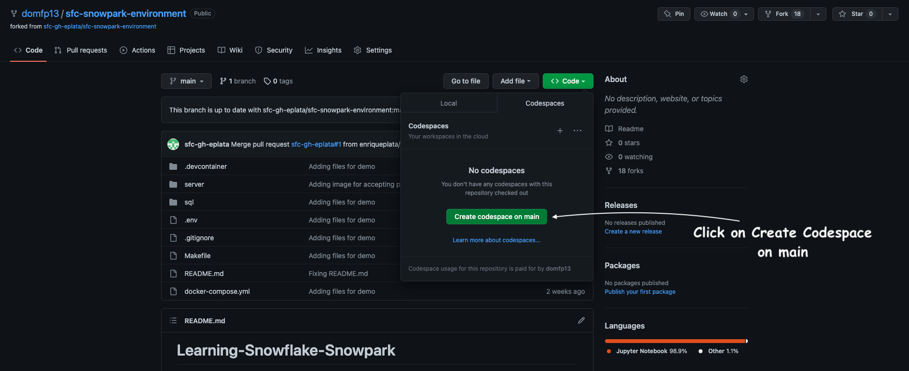
  * The lunching of the instance can take up to 5+ minutes 
    * 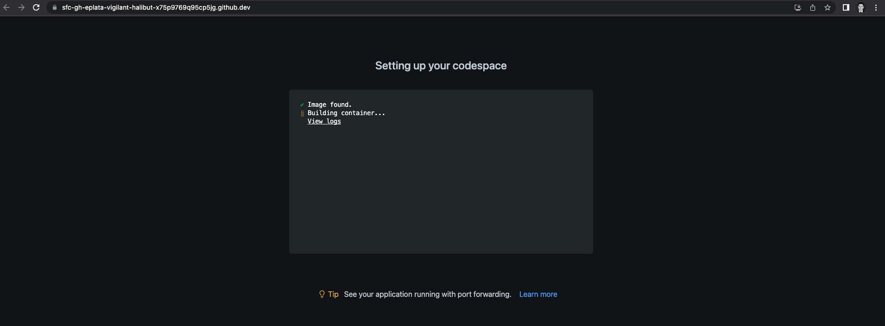
## Clean Up
  * To remove the Codespace instace go to the Codespaces section.
    * 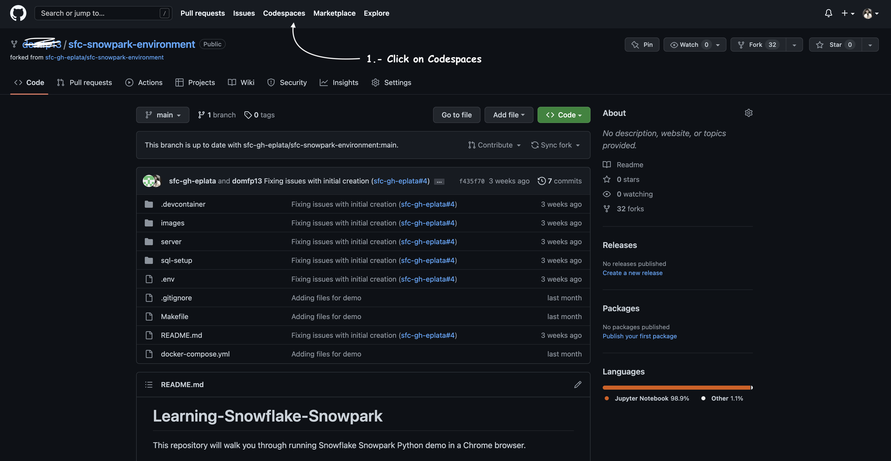
    * 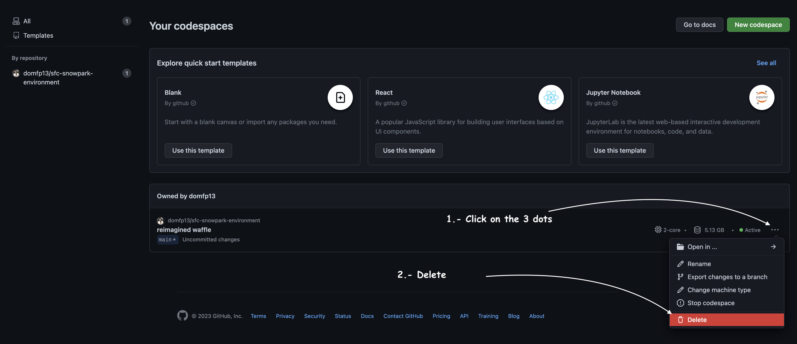

## Author
* **Enrique Plata**
